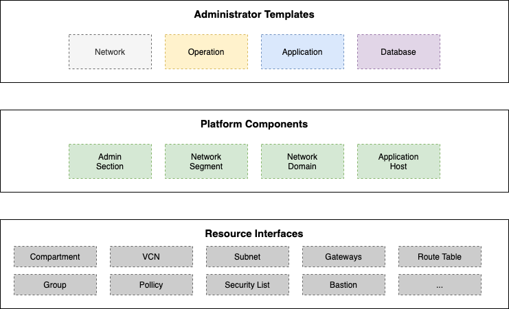

= The OCloud Framework: Landing Zone

[#img-license][link="https://img.shields.io/badge/license-UPL-green"]image:https://img.shields.io/badge/license-UPL-green[License: UPL]

[#img-quality][link="https://sonarcloud.io/dashboard?id=oracle-devrel_terraform-oci-ocloud-landing-zone"]image:https://sonarcloud.io/api/project_badges/quality_gate?project=oracle-devrel_terraform-oci-ocloud-landing-zone[Quality gate]

[#img-deployment]
[link="https://cloud.oracle.com/resourcemanager/stacks/create?zipUrl=https://github.com/oracle-devrel/terraform-oci-ocloud-landing-zone/archive/refs/heads/main.zip"]
image:https://oci-resourcemanager-plugin.plugins.oci.oraclecloud.com/latest/deploy-to-oracle-cloud.svg[Deploy on Oracle Cloud]

== Introduction
The service delivery framework "ocloud" helps operators to quickly set up a hosting environment for enterprise applications in Oracle Cloud Infrastructure (OCI). While launching a new resource in OCI is a matter of loging in and pressing a button, the preperation of a tenancy that extends a private data center can be challenging. Provisioning private ressources in a secured environment involves numberous services and requires a deep understanding of various configuration options build into Oracle's Cloud Infrastructure platform.

[#img-structure] 
.Code Structure 

This framework helps to automate the provisioning processes for a service delivery platform. It rolls out a typical network design, implements a security baseline and ensures consistent names for core infrastructure components. The setup reflects the separation of duties, typically found in an ITIL oriented organization and builds a foundation for a multi-tenant service operation. 

== Getting Started
The first layer of code addresses the needs of system adminstrators. It is written in HCL and captures the parameters that customize the provisioning processes for OCI core resources. The default repository separates four templates:

* https://gitlab.com/tboettjer/ocloud-platform/-/blob/master/operation.tf[Operations] prepares a working environment cloud- and security operators with an "ops" compartment that contains base roles like the cloud "super admin".
* https://gitlab.com/tboettjer/ocloud-platform/-/blob/master/network.tf[Network] provisions an initial network segment and creates a "web" domain for internet facing portals beside the "netops" compartment and role.
* https://gitlab.com/tboettjer/ocloud-platform/-/blob/master/database.tf[Database] defines the infrastructure for database hosting with access via port 1521-1522 in addition to the "db" compartment and admin role.
* https://gitlab.com/tboettjer/ocloud-platform/-/blob/master/application.tf[Application] creates an application management domain, the an app compartment, the sysops role and deploys an operator for remote scripts.

The ops and the net deployment templates are obligatory, the db and the app templates are optional. The bastion service connects to an operator in the application domain and allows to enter all domains via SSH.

==== Components
Templates refer to terraform modules, rather than addressing resource blocks directly. Platform components combine multiple resources logically into Terraform modules. These modules contain best practices collected throughout numberous projects and remain subject to change. Initially we provide the following modules:

* https://gitlab.com/tboettjer/ocloud-platform/-/tree/master/module/admin_section[Administrator Section] is the compartment block combined with groups an policies that define a working environment for cloud and security operators
* https://gitlab.com/tboettjer/ocloud-platform/-/tree/master/module/network_segment[Network Segment] defines the compart and role for network administrators together with a Virtual Cloud Network (VCN) incl. Dynamic Routing Gateway and gateways for NAT, Intenrnet and Oracle Services
* https://gitlab.com/tboettjer/ocloud-platform/-/tree/master/module/network_domain[Network Domain] creates a subnet with portfilters and routing rules
* https://gitlab.com/tboettjer/ocloud-platform/-/tree/master/module/application_host[Application Host] launches a compute node and executes the respective configuration scripts are executed

=== Dependencies

[cols="1,1,1"]
|===
|
|Roles
|Subnets

|Admin Section
|Groups, Policies
|...

|Network Segment
|...
|...

|Network Domain
|... 
|...

|Application Host
|...
|...
|=== 

=== Interfaces

Modules deploy a variety of different resources, like infrastructure components, predefined cloud services, applications or third party software products. Usually we employ the terraform service provider to provision resources, however, comand line scripts, API or SDK are additional options.

=== Prerequisites
MISSING

== Notes/Issues
* The VPN connection is not tested yet
* Destroying compartments should be an exception and can take a long time. Best practice is destroying all other resources first, before destroying the compartments in a separate run. In the default setup, the "enable_delete" flag prevent unintensional destroy of compartments
* The bastion service is limited to port forwarding, managed ssh does not work at the moment. 
* Using Terraform 1.0 produces a warning about missing provider definitions in the module directories, which can be ignored.
* Missing wait states cause deployment errors, terraform apply might need to be applied multiple times

== URLs
* Nothing at this time

== Contributing
This project is open source.  Please submit your contributions by forking this repository and submitting a pull request!  Oracle appreciates any contributions that are made by the open source community.

== License
Copyright (c) 2021 Oracle and/or its affiliates.

Licensed under the Universal Permissive License (UPL), Version 1.0.

See link:LICENSE[LICENSE] for more details.

[.text-right]
link:doc/introduction.adoc[Documentation >]
